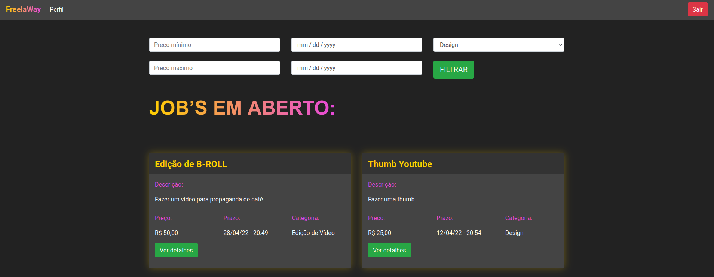
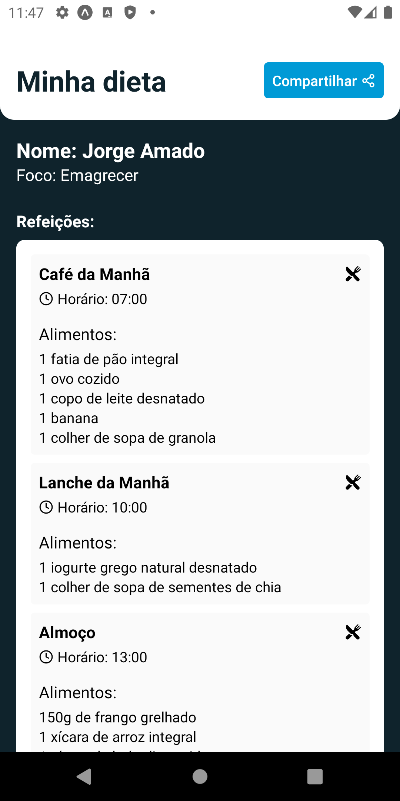

<h1 align="center">
  
</h1>

<h4 align="center">
  Projects done on code learning events.
</h4>

 
 

### [Alura](https://www.alura.com.br/)

- [Alurakut](https://github.com/pablomaribondo/alurakut) - To be completed

### [Pythonando](https://pythonando.com.br/)

- [FreelaWay](https://github.com/pablomaribondo/freelaway)

 <kbd>
    
  </kbd>

### [Sujeito Programador](https://sujeitoprogramador.com)

- [Dieta IA](https://github.com/pablomaribondo/dieta-ia)

<kbd>
  
</kbd>
